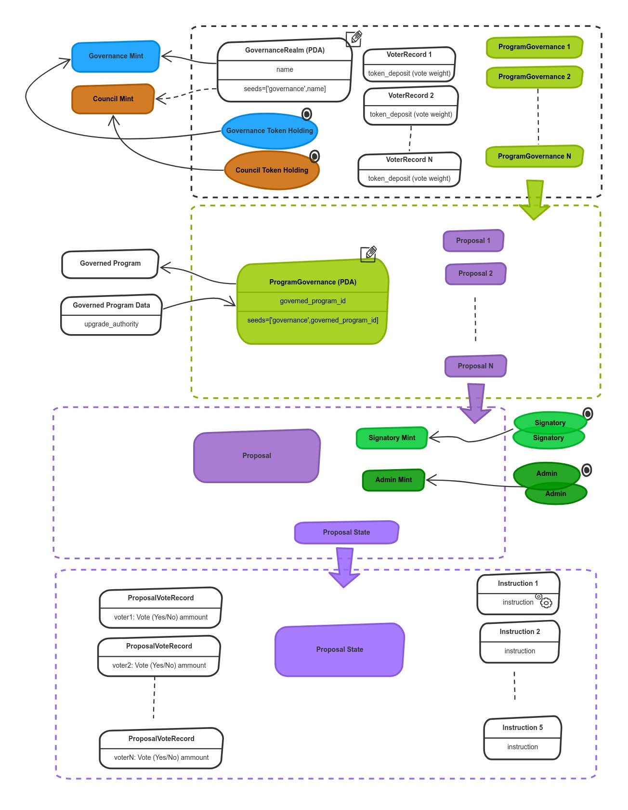
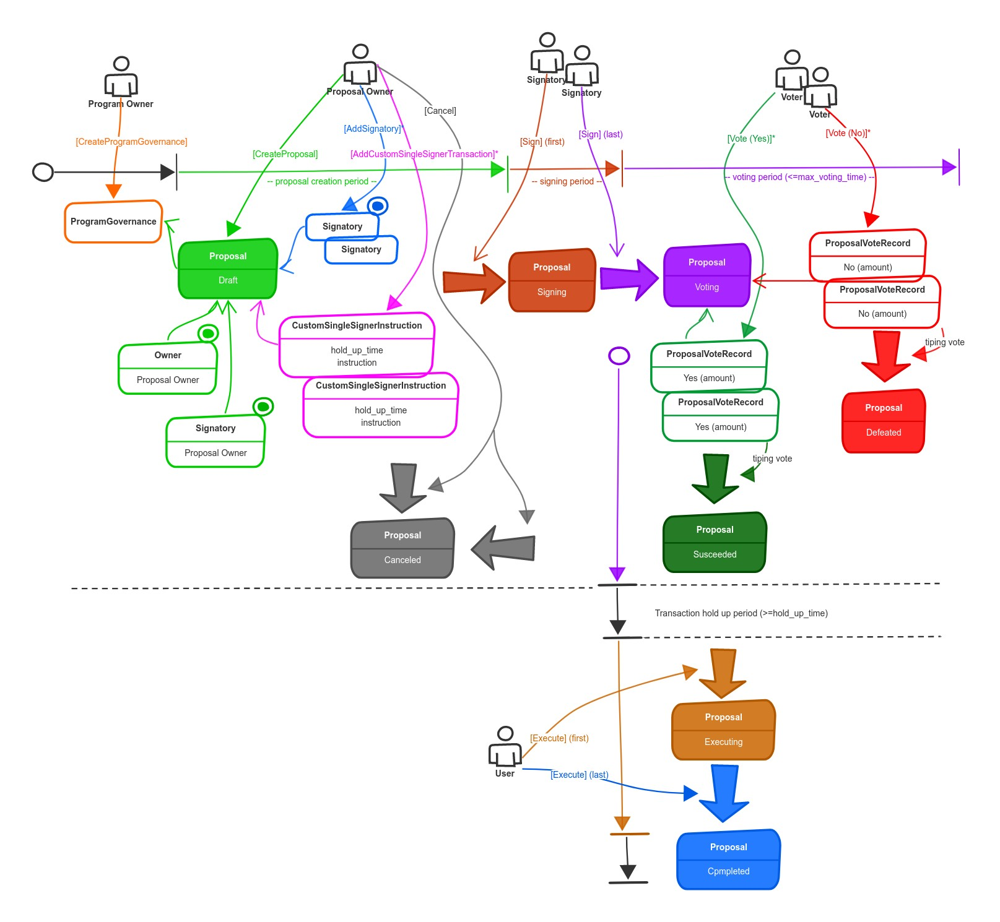

# SPL Governance

SPL Governance is a program the chief purpose of which is to provide core building blocks and primitives to create
Decentralized Autonomous Organizations (DAOs) on Solana blockchain.

The program is DAO type and asset type agnostic and can be used to build any type of DAOs
which can own and manage any type of assets.

For example it can be used as an authority provider for mints, token accounts and other forms of access control where
we may want a voting population to vote on disbursement of funds collectively.
It can also control upgrades of itself and other programs through democratic means.

In the simplest form the program can be used for Multisig control over a shared wallet (treasury account) or as
a Mutlisig upgrade authority for Solana programs

## Architecture

The program is modular and uses open/close architecture where individual parts of the program's
behavior can be customized through external plugins.

For example the default implementation of the program takes deposits of the governance tokens in exchange for
voting power but it can be swapped with a custom program implementation which can implement any custom requirements
like token locking, token escrows, NFT voting or multi token governance structures.

The plugins are ordinary Solana programs and can be written using any supporting technology like Anchor framework
for example.

## Deployment

The program supports two deployment models 1) DAO owned instance and 2) shared instance

### 1) DAO owned instance

When a DAO needs full control over the governance program then it's recommended to deploy and use its own instance
and put it under the DAO governance.
This way only the DAO can ever change and upgrade the most important program it uses.

Note: Using your own instance is not the same as forking the source code. It simply means deploying the program's code
and transferring its upgrade authority to the DAO.

### 2) Shared instance

In cases where deploying the owned instance is not practical a shared instances of the program can be used.
There are two instances available for anybody to use on mainnet

`GovER5Lthms3bLBqWub97yVrMmEogzX7xNjdXpPPCVZw` - default `spl-governance` instance

`GTesTBiEWE32WHXXE2S4XbZvA5CrEc4xs6ZgRe895dP` - test instance which can be used to setup test DAOs

## Governance UI

There are two UIs available which showcase the programs capabilities:

- [Realms Explorer](https://github.com/solana-labs/oyster) project (part of Oyster monorepo) provides basic and data
  oriented UI to create and manage DAOs: [realms-explorer](https://realms-explorer.com/)

  It's a good starting point for developers to learn about the program and interact with it

- [Governance UI](https://github.com/solana-labs/governance-ui) project build together
  with the [MNGO](https://mango.markets/) team: [governance-ui](https://realms.today)

  This is advanced, user friendly and tasks oriented UI used by most of the existing DAOs on Solana

## Client SDK

[@solana/spl-governance](https://www.npmjs.com/package/@solana/spl-governance)

## Documentation and Help

Program and UI documentation: [spl-governance-docs](https://docs.realms.today)

Discord server: [spl-governance-discord](https://discord.gg/VsPbrK2hJk)

## Program Accounts

The diagram belows shows an illustrative configuration of the program accounts when used to control upgrades
of multiple programs through proposals

### Realm account

Realm account ties Community Token Mint and optional Council Token mint to create a realm
for any governance pertaining to the community of the token holders.
For example a trading protocol can issue a governance token and use it to create its governance realm.

Once a realm is created voters can deposit Governing tokens (Community or Council) to the realm and
use the deposited amount as their voting weight to vote on Proposals within that realm.

### Program Governance account

The basic building block of governance to update programs is the ProgramGovernance account.
It ties a governed Program ID and holds configuration options defining governance rules.
The governed Program ID is used as the seed for a [Program Derived Address](https://docs.solana.com/developing/programming-model/calling-between-programs#program-derived-addresses),
and this program derived address is what is used as the address of the Governance account for your Program ID.

What this means is that there can only ever be ONE Governance account for a given Program.
The governance program validates at creation time of the Governance account that the current upgrade authority of the program
taken under governance signed the transaction. Optionally `CreateProgramGovernance` instruction can also transfer `upgrade_authority`
of the governed program to the Governance PDA at the creation time of the Governance account.

### Mint Governance account

A mint governance account allows a mint authority to setup governance over an SPL Mint account.
The Governance program validates at creation time that the current mint authority signed the transaction to
create the governance and optionally can transfer the authority to the Governance account.
Once setup the Mint Governance allows governance participants to create Proposals which execute mint instructions for
the governed Mint.

### Token Governance account

A token governance account allows a token account owner to setup governance over an SPL Token account.
The Governance program validates at creation time the current owner signed the transaction to
create the governance and optionally can transfer the owner to the Governance account.
Once setup the Token Governance allows participants to create Proposals to execute transfer instructions
from the governed token account.

### How does the authority work?

Governance can handle arbitrary executions of code. In the program governance case it can execute program upgrades.
It does this through executing instructions to the bpf-upgradable-loader program.
Bpf-upgradable-loader allows any signer who has Upgrade authority over a Buffer account and the Program account itself
to upgrade it using its Upgrade command.
Normally, this is the developer who created and deployed the program, and this creation of the Buffer account containing
the new program data and overwriting of the existing Program account's data with it is handled in the background for you
by the Solana program deploy cli command.
However, in order for Governance to be useful, Governance now needs this authority.

In similar fashion for Mint and Token governances the relevant authorities to mint and transfer tokens
are transferred to the Governance account. It in turn allows participants to create and vote on Proposals
which can then execute
mint and transfer instructions for the governed accounts.

### Proposal accounts

A Proposal is an instance of a Governance created to vote on and execute given set of instructions.
It is created by someone (Proposal Owner) and tied to a given Governance account
and has a set of executable instructions to it, a name and a description.
It goes through various states (draft, voting, executing, ...) and users can vote on it
if they have relevant Community or Council tokens.
Its rules are determined by the Governance account that it is tied to, and when it executes,
it is only eligible to use the [Program Derived Address](https://docs.solana.com/developing/programming-model/calling-between-programs#program-derived-addresses)
authority given by the Governance account.
So a Proposal for Sushi cannot for instance upgrade the Program for Uniswap.

When a Proposal is created by a user then the user becomes Proposal Owner and receives permission to edit the Proposal.
With this power the Owner can edit the Proposal, add/remove Signatories to the Proposal and also cancel it.
These Signatories can then show their approval of the Proposal by signing it off.
Once all Signatories have signed off the Proposal the Proposal leaves Draft state and enters Voting state.
Voting state lasts as long as the Governance has it configured to last, and during this time
people holding Community (or Council) tokens may vote on the Proposal.
Once the Proposal is "tipped" it either enters the Defeated or Succeeded state. If the vote can't be tipped automatically
during the voting period but still reaches the required Yes vote threshold it can be manually transitioned to Succeeded state
using FinalizeVote instruction.
Once all Proposal transactions are executed the Proposal enters Completed state.

In the Executing state an instruction can be run by any one at any time after the `instruction_hold_up_time` period has
transpired.

### ProposalTransaction

A Proposal can have multiple Proposal Transactions with multiple instructions each, and they run independently of each other.
These contain the actual data for instructions, and how long after the voting phase a user must wait before they can
be executed.

### Voting Dynamics

When a Proposal is created and signed by its Signatories voters can start voting on it using their voting weight,
equal to deposited governing tokens into the realm. A vote is tipped once it passes the defined `vote_threshold` of votes
and enters Succeeded or Defeated state. If Succeeded then Proposal instructions can be executed after they hold_up_time passes.

Users can relinquish their vote any time during Proposal lifetime, but once Proposal is decided their vote can't be changed.

### Community and Councils governing tokens

Each Governance Realm that gets created has the option to also have a Council mint.
A council mint is simply a separate mint from the Community mint.
What this means is that users can submit Proposals that have a different voting population from a different mint
that can affect the same DAO. A practical application of this policy may be to have a very large population control
major version bumps of Solana via normal SOL, for instance, but hot fixes be controlled via Council tokens,
of which there may be only 30, and which may be themselves minted and distributed via proposals by the governing population.

Another important use case is to use the Council for DAO inception. At the beginning of a DAO life
there are lots of risks and unknowns.
For example it's not known whether the community of token holders would engage and participate in DAO votes.
And if it would engage then to what extent. It means it can be difficult for example to decide how many votes are
required for a proposal to be successfully voted on.
This is why in order to avoid traps and potentially irreversible actions the Council can be used as a safety net
in a similar way to Multisig to moderate and supervise the voting process at the DAO inception.
Once the newly born DAO goes through several successful proposal votes and everything is going smoothly
the council can be removed from the DAO through a community vote.

The Council can also be used for protocols and communities which haven't launched their token yet.
In such cases the DAO can be setup with the yet to launch token and the Council which would governed
the DAO until the token is distributed.

### Proposal Workflow

