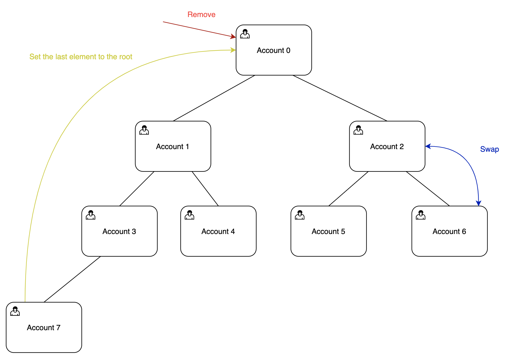

# Heap Storage
Heap is a tree-like data structure for storing large ordered sets of data. You can think of a heap as a binary tree with comparable nodes and each node having up to two child nodes. For the ordered heap each parent node should be either larger (max-heap) or smaller (min-heap) than the child node.

This program is an abstract heap implementation, it stores arbitrary 32-byte values which can be interpreted by the entity using this contract. New nodes can be added only to the end of the heap and removed only from the top of the heap. It is also possible to swap adjacent parent-child nodes.

The typical usage of this data structure is to add elements to the heap (like lending obligations for example) and if the node needs to be removed (obligation to be liquidated) it has to be swapped to the top first (too see if there are less healthy obligations to be liquidated before).

## Accounts
This program manages two account types: Heap and Node. Heap is a single account storing data about the heap like its size and authority which can modify the heap. And Node account stores each particular node of the heap.

## Instructions

### Init heap
Initializes new heap account.

### Add node
Adds a new node to the end of the heap.

### Remove root node
Removes the root node from the heap and replace it with the last node. 

### Swap node accounts
Swaps parent-child accounts. It is the job of the caller to compare the nodes, this contract simply checks if the nodes are parent and child and swaps their data.
Check out this [demonstration](https://www.cs.usfca.edu/~galles/visualization/Heap.html) of how such swaps work.



## Build and test
```
$ cargo build-bpf
$ cargo test-bpf
```